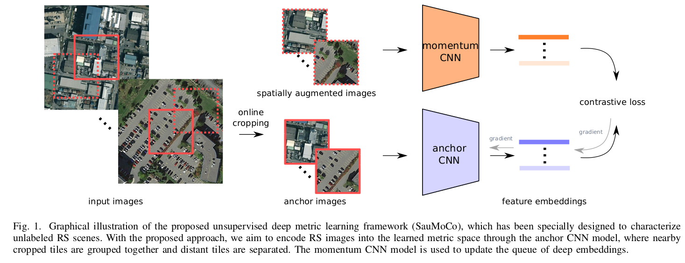
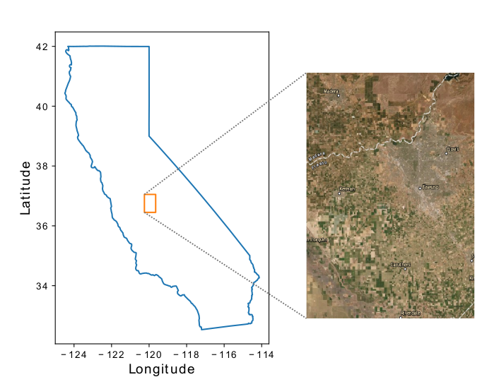
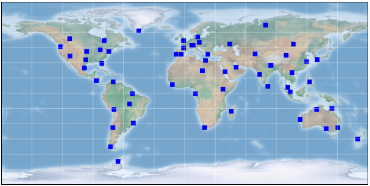

# Deep Unsupervised Embedding for Remotely Sensed Images based on Spatially Augmented Momentum Contrast

[Jian Kang](https://github.com/jiankang1991), [Ruben Fernandez-Beltran](https://scholar.google.es/citations?user=pdzJmcQAAAAJ&hl=es), [Puhong Duan](https://scholar.google.ch/citations?user=IYUlx_8AAAAJ&hl=en), [Sicong Liu](https://sites.google.com/site/sicongliurs/home), [Antonio Plaza](https://www.umbc.edu/rssipl/people/aplaza/)

---

This repo contains the codes for the TGRS paper: [Deep Unsupervised Embedding for Remotely Sensed Images based on Spatially Augmented Momentum Contrast](https://ieeexplore.ieee.org/document/9140372) We propose a new unsupervised deep metric learning model, called spatially augmented momentum contrast (SauMoCo), which has been specially designed to characterize unlabeled RS scenes. Based on the first law of geography, the proposed approach defines a spatial augmentation criteria to uncover semantic relationships among land cover tiles. Then, a queue of deep embeddings is constructed to enhance the semantic variety of RS tiles within the considered contrastive learning process, where an auxiliary CNN model serves as an updating mechanism. Some codes are modified from [CMC](https://github.com/HobbitLong/CMC) and [Tile2Vec](https://github.com/ermongroup/tile2vec).



<!-- <p align="center">

</p> -->

## Usage

### Dataset

* **NAIP full scenes** located in Central Valley areas near Fresno, California through the [USGS EarthExplorer](https://earthexplorer.usgs.gov/). The
geo-locations of the downloaded scenes are inside the
orange rectangle in the following image. Then, we randomly select a total of 100,000 images (with a size of 250×250 pixels) from the downloaded tiles. Note NAIP is first utilized in [Tile2Vec](https://arxiv.org/abs/1805.02855) framework.

<p align="center">



* **Sentinel-2 tiles**, we downloaded 100 Sentinel-
2 Level-1C image products which have been globally
sampled from the entire globe. The following image illustrates the geo-locations of the downloaded Sentinel-2 products. Then, we select 100,000 random images (with a size of 264 × 264 pixels) from the downloaded products. The product IDs of these tiles can be found in [DSen2](https://github.com/lanha/DSen2).

<p align="center">


### Training

* `./data/npy2lmdb.py` is the script for transforming the 100,000 npy files into a big [LMDB](https://lmdb.readthedocs.io/en/release/) file as the input dataset.

* `./train/main_NAIP_MoCo.py` and `./train/main_Sen2_MoCo.py` are utilized for training on the NAIP and Sen2 dataset with SauMoCo.

* `./utils/NAIP_data_gen.py` and `./utils/Sen2_data_gen.py` are the data classes of NAIP and Sen2 designed for SauMoCo, where positive and negative image pairs are generated in an online manner during the training phase.

### Testing

After training the CNN models on the two created datasets by using SauMoCo, the trained CNN models can be further exploited as feature extraction for NAIP and EuroSAT datasets to evaluate the encoding performance.

## Citation

```
@article{kang2020deepunsu,
  title={{Deep Unsupervised Embedding for Remotely Sensed Images based on Spatially Augmented Momentum Contrast}},
  author={Kang, Jian and Fernandez-Beltran, Ruben and Duan, Puhong and Liu, Sicong and Plaza, Antonio},
  journal={IEEE Transactions on Geoscience and Remote Sensing},
  year={2020},
  note={DOI:10.1109/TGRS.2020.3007029}
  publisher={IEEE}
}
```

## References
[1] Jean, Neal, et al. "Tile2vec: Unsupervised representation learning for spatially distributed data." Proceedings of the AAAI Conference on Artificial Intelligence. Vol. 33. 2019.

[2] He, Kaiming, et al. "Momentum contrast for unsupervised visual representation learning." arXiv preprint arXiv:1911.05722 (2019).

[3] Tian, Yonglong, Dilip Krishnan, and Phillip Isola. "Contrastive multiview coding." arXiv preprint arXiv:1906.05849 (2019).
